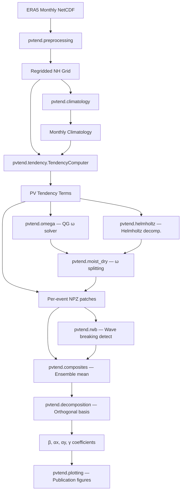

# pvtend

[](https://github.com/yanxingjianken/pvtend/actions)
[](https://pvtend.readthedocs.io/en/latest/)
[](LICENSE)

**PV tendency decomposition for atmospheric blocking and precursor reverse-flow (PRP) event lifecycle analysis.**

`pvtend` diagnoses the growth, propagation, and decay of mid-latitude weather events by decomposing potential vorticity (PV) tendencies on ERA5 pressure-level data into physically meaningful components using an orthogonal basis framework.

## Features

- **PV tendency computation**: Advection, stretching, diabatic, and residual terms
- **QG omega solver**: Hoskins Q-vector formulation with FFT+Thomas algorithm
- **Helmholtz decomposition**: 4 backends (direct, FFT, DCT, SOR) for limited-area domains
- **Moist/dry omega splitting**: Decomposes vertical motion into moist and dry contributions
- **Orthogonal basis decomposition**: Projects PV tendency onto intensification (β), propagation (αx, αy), and deformation (γ) modes
- **RWB detection**: Anticyclonic/cyclonic Rossby wave breaking classification
- **Composite lifecycle**: Multi-stage ensemble averaging with onset/peak/decay staging
- **CLI pipeline**: End-to-end processing via `pvtend-pipeline` command

## Installation

```bash
# From source
git clone https://github.com/yanxingjianken/pvtend.git
cd pvtend
pip install -e ".[dev]"

# With micromamba
micromamba create -f environment.yml
micromamba activate pvtend_env
pip install -e ".[dev]"
```

## Quick Start

```python
import pvtend

# Compute zonal derivative
import numpy as np
dfdx = pvtend.ddx(field, dlon_rad=np.deg2rad(0.5),
                   lat_1d=np.linspace(30, 50, 21))

# Orthogonal basis decomposition
from pvtend.decomposition import compute_orthogonal_basis, project_field

basis = compute_orthogonal_basis(q_prime, q_full, x_rel, y_rel, dx, dy)
result = project_field(tendency, basis, dx, dy)
print(f"β = {result['beta']:.3e}")  # intensification rate
```

### CLI Pipeline

```bash
# Step 1: Compute PV tendencies
pvtend-pipeline compute \
    --event-type blocking \
    --events-csv events.csv \
    --era5-dir /data/era5/ \
    --clim-dir /data/climatology/ \
    --out-dir /data/output/ \
    --skip-existing

# Step 2: Build composite
pvtend-pipeline composite \
    --npz-dir /data/output/ \
    --pkl-out composite.pkl
```

## Workflow



## Package Structure

```
src/pvtend/
├── __init__.py          # Public API
├── _version.py          # Version
├── cli.py               # CLI entry point
├── constants.py         # Physical constants
├── grid.py              # NH grid & event patches
├── preprocessing.py     # ERA5 loading & regridding
├── derivatives.py       # Finite difference operators
├── climatology.py       # Fourier-filtered climatology
├── omega.py             # QG omega equation solver
├── helmholtz.py         # Helmholtz decomposition
├── moist_dry.py         # Moist/dry omega split
├── tendency.py          # Main pipeline class
├── rwb.py               # Rossby wave breaking
├── composites.py        # Composite lifecycle
├── decomposition/       # Orthogonal basis framework
│   ├── __init__.py
│   ├── smoothing.py
│   ├── basis.py
│   └── projection.py
├── plotting/            # Visualization
│   ├── __init__.py
│   ├── basis_plots.py
│   ├── coefficient_plots.py
│   └── field_plots.py
└── io/                  # File I/O
    ├── __init__.py
    ├── era5.py
    ├── npz.py
    └── pkl.py
```

## Testing

```bash
pytest tests/ -v
```

## Documentation

Full documentation at [pvtend.readthedocs.io](https://pvtend.readthedocs.io).

Build locally:

```bash
cd docs && make html
```

## Citation

If you use this package in your research, please cite:

```bibtex
@software{yan2025pvtend,
  author = {Yan, Xingjian},
  title = {pvtend: PV tendency decomposition for atmospheric blocking},
  year = {2025},
  url = {https://github.com/yanxingjianken/pvtend}
}
```

## License

MIT — see [LICENSE](LICENSE).
