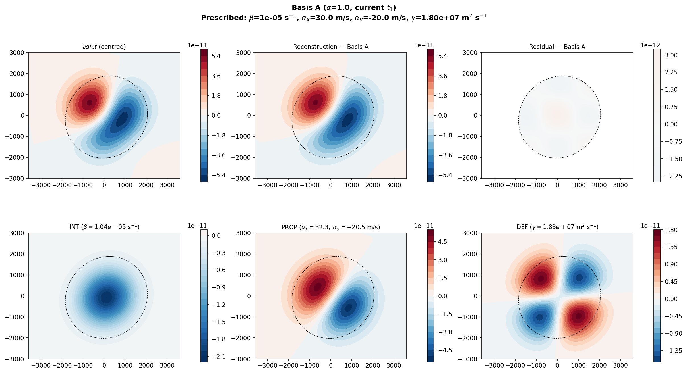
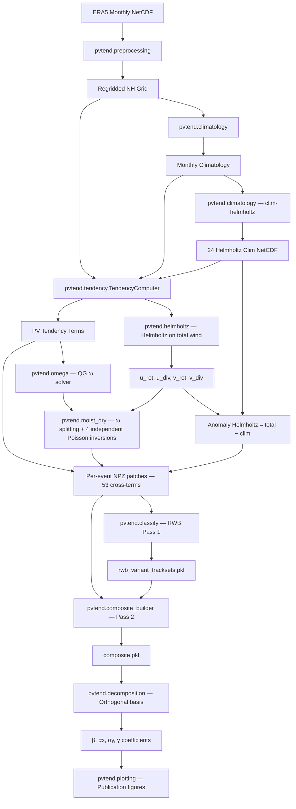

# pvtend

[](https://pypi.org/project/pvtend/)
[](https://github.com/yanxingjianken/pvtend/actions)
[](https://pvtend.readthedocs.io/en/latest/)
[](LICENSE)

**PV tendency decomposition for atmospheric blocking, propagating anticyclones, and all synoptic-scale cyclonic event lifecycle analysis.**

`pvtend` diagnoses the growth, propagation, and decay of mid-latitude weather events by decomposing potential vorticity (PV) tendencies from ERA5 pressure-level data onto physically meaningful components using an orthogonal basis framework. This is the Part I work of Yan et al. (in prep.) about blocking lifecycle analyses on onset, peak, decay stages.

## Gallery

<table>
<tr>
<td width="50%" align="center">
<br/>
<em>Idealized validation — a Gaussian PV anomaly with prescribed propagation,
intensification, and deformation is decomposed into four orthogonal bases
and reconstructed with near-zero residual.</em>
</td>
<td width="50%" align="center">
<br/>
<em>Real ERA5 blocking event (track 425) — animated lifecycle showing
total PV on a cartopy map (left) and the four projected basis components
(right) evolving from 13 h pre-onset to 12 h post-onset.
The analysis is done on a weighted average surface across 300, 250, 200 hPa levels.</em>
</td>
</tr>
<tr>
<td colspan="2" align="center">
<br/>
<em>Geopotential-height (Z500) variant of the four-basis decomposition
(track 425) — animated lifecycle showing Z anomaly from the 1990–2020
hourly climatology, with adaptive prenorm and blockid contour overlay.
See notebook <code>03z_four_basis_projection_geopotential</code>.</em>
</td>
</tr>
</table>

### Event catalogues

Blocking and PRP-high events are identified as persistent anticyclonic anomalies in 500 hPa geopotential height.
We are using [**TempestExtremes** v2.1](https://gmd.copernicus.org/articles/14/5023/2021/) to track contiguous Z500 anomaly features that exceed a fixed threshold for ≥5 days, producing CSV catalogues with columns for event ID, centre lat/lon, onset/peak/decay timestamps, and area. Following the threshold as in [Drouard et al. (2021)](https://agupubs.onlinelibrary.wiley.com/doi/abs/10.1029/2020JD034082), we separate the tracked features into blocking and propagating (prp) high pressure systems.

> **Sample catalogue (ERA5, 1990–2020 blocking):** [`ERA5_TempestExtremes_z500_anticyclone_blocking.csv`](https://github.com/yanxingjianken/pvtend/raw/main/docs/_static/ERA5_TempestExtremes_z500_anticyclone_blocking.csv)

The CSVs are the inputs for `pvtend-pipeline compute`, which extracts event-centred patches and runs the full PV-tendency decomposition for each event in the blocking/prp catalogue.

## Features

- **Helmholtz-first architecture** (v2.0): Helmholtz decomposition on the **total wind** field; climatological Helmholtz pre-computed as 24 monthly NetCDF files; anomaly Helmholtz = total − clim (no separate anomaly solve)
- **53 cross-term PV tendency budget**: 20 primary + 16 alt-vertical + 16 div dry/moist horizontal + Q_LHR, all written per-timestep to NPZ
- **PV tendency computation**: RHS has zonal advection, baroclinic counter propagation, vertical advection, and approximated diabatic heating terms.
- **QG omega solver**: Hoskins Q-vector formulation with **two methods**: LOG20/SIP (default, Numba-accelerated 3-D elliptic, Li & O'Gorman 2020) and SP19 (Steinfeld & Pfahl 2019 empirical 1/3 scaling). Optional `center_lat` for dynamic f₀.
- **Helmholtz decomposition**: Spherical vorticity/divergence (with tan φ/a metric), conservative spherical Poisson solver (FFT in lon + tridiagonal in lat), spectral gradient for wind recovery — all on the full NH grid
- **Four-way omega decomposition**: ω_dry (QG A+B), ω_qg_moist (term C via ∂T/∂t), ω_emanuel_moist (Emanuel LHR), ω_moist (full residual), with corresponding divergent winds recovered by **independent** spherical Poisson inversion (verified linear to machine precision)
- **Orthogonal basis decomposition**: Projects PV tendency onto intensification (β), propagation (αx, αy), and deformation (γ) modes. Built-in **temporal down-scaling** (bi-linear interpolation, α = 0.75 by default) from hourly to 15-minute evaluation instants via `_next` keyword arguments. **Single-blob selection**: when the threshold mask produces multiple disconnected regions, only the connected component enclosing (or nearest to) the patch centre is retained
- **RWB detection**: Two classification methods — **bay** (path-order, recommended with circumpolar-cropped contours) and **tilt** (centerline slope ±0.15 dead zone). Circumpolar-first contour extraction for robust NH analysis.
- **Composite lifecycle**: Multi-stage ensemble averaging with onset/peak/decay staging
- **NaN-safe throughout**: All grid, derivative, solver, bootstrap, and plotting routines use `nanmean`/`nanpercentile` to handle partial-NaN edge events without corrupting composites or flipping projection signs
- **CLI pipeline**: End-to-end processing via `pvtend-pipeline` command

## Installation

```bash
# From PyPI
pip install pvtend

# Or with uv (fast, Rust-based installer)
uv pip install pvtend

# From source (development)
git clone https://github.com/yanxingjianken/pvtend.git
cd pvtend
pip install -e ".[dev]"

# With micromamba
micromamba create -f environment.yml
micromamba activate pvtend_env
pip install -e ".[dev]"
```

## Quick Start

```python
import numpy as np
from pvtend import NHGrid, ddx, ddy, compute_orthogonal_basis, project_field

# Grid setup
grid = NHGrid(lat=np.linspace(90, 0, 61), lon=np.linspace(-180, 178.5, 240))
dx_arr = grid.dx_arr  # zonal spacing per latitude [m]
dy = grid.dy           # meridional spacing [m]

# Compute zonal derivative
dfdx = ddx(field, dx_arr, periodic=False)

# Orthogonal basis decomposition
basis = compute_orthogonal_basis(pv_anom, pv_dx, pv_dy, x_rel, y_rel)
result = project_field(tendency, basis)
print(f"β = {result['beta']:.3e}")  # intensification rate
```

### CLI Pipeline

```bash
# Step 0a: Pre-compute Helmholtz climatology (once, ~5 min)
pvtend-pipeline clim-helmholtz \
    --clim-dir /data/climatology/ \
    --out-dir /data/climatology/

# Step 1: Compute PV tendencies → per-event NPZ files
pvtend-pipeline compute \
    --event-type blocking \
    --events-csv events.csv \
    --era5-dir /data/era5/ \
    --clim-path /data/climatology/era5_hourly_clim.nc \
    --clim-helmholtz-dir /data/climatology/ \
    --out-dir /data/composite_blocking_tempest/ \
    --dh-range=-49:25 --skip-existing

# Step 2: RWB classification → variant tracksets PKL
#   --levels accepts integer hPa values or 'wavg' (weighted-average Z)
pvtend-pipeline classify \
    --npz-dir /data/composite_blocking_tempest/ \
    --output /data/outputs/rwb_variant_tracksets.pkl \
    --stages onset peak decay \
    --levels 500 400 300 200 --threshold 3

# Step 3: Variant-aware composite accumulation → composite PKL
pvtend-pipeline composite \
    --npz-dir /data/composite_blocking_tempest/ \
    --rwb-pkl /data/outputs/rwb_variant_tracksets.pkl \
    --pkl-out /data/outputs/composite.pkl

# Step 4 (optional): Orthogonal-basis decomposition
pvtend-pipeline decompose \
    --pkl-in /data/outputs/composite.pkl \
    --out-dir /data/outputs/decomp/
```

## Workflow


```mermaid
graph TD
    A[ERA5 Monthly NetCDF] --> B[pvtend.preprocessing]
    B --> C[Regridded NH Grid]
    C --> D[pvtend.climatology]
    D --> E[Monthly Climatology]
    E --> E2[pvtend.climatology — clim-helmholtz]
    E2 --> E3[24 Helmholtz Clim NetCDF]
    C & E & E3 --> F[pvtend.tendency.TendencyComputer]
    F --> G[PV Tendency Terms]
    F --> I[pvtend.helmholtz — Helmholtz on total wind]
    I --> I2[u_rot, u_div, v_rot, v_div]
    I2 & E3 --> I3[Anomaly Helmholtz = total − clim]
    G --> H[pvtend.omega — QG ω solver]
    H & I2 --> J[pvtend.moist_dry — ω splitting + 4 independent Poisson inversions]
    G & J & I3 --> K[Per-event NPZ patches — 53 cross-terms]
    K --> L1[pvtend.classify — RWB Pass 1]
    L1 --> L1a[rwb_variant_tracksets.pkl]
    K & L1a --> L2[pvtend.composite_builder — Pass 2]
    L2 --> L2a[composite.pkl]
    L2a --> M[pvtend.decomposition — Orthogonal basis]
    M --> N[β, αx, αy, γ coefficients]
    N --> O[pvtend.plotting — Publication figures]
```

## Package Structure

```
src/pvtend/
├── __init__.py          # Public API
├── _version.py          # Version
├── cli.py               # CLI entry point (clim-helmholtz, compute, classify, composite, decompose)
├── constants.py         # Physical constants
├── grid.py              # NH grid & event patches
├── preprocessing.py     # ERA5 loading & regridding
├── derivatives.py       # Finite difference operators
├── climatology.py       # Fourier-filtered climatology + Helmholtz climatology (compute/load)
├── omega.py             # QG omega solver (LOG20/SIP or SP19)
├── helmholtz.py         # Helmholtz decomposition (spherical Poisson + spectral gradient + laplacian_spherical_fft)
├── moist_dry.py         # Moist/dry omega split & independent Poisson wind recovery (solve_chi_from_omega, verify_div_additivity)
├── isentropic.py        # Isentropic PV-tendency diagnostics
├── tendency.py          # Main pipeline: Helmholtz-first, 53 cross-terms, data loading, derivatives, NPZ output
├── classify.py          # RWB classification Pass 1 (AWB/CWB/NEUTRAL → variant PKL)
├── composite_builder.py # Variant-aware composite accumulation Pass 2
├── rwb.py               # RWB detection (bay & tilt methods, circumpolar-first)
├── composites.py        # Legacy composite lifecycle
├── data/                # Bundled sample data
│   ├── __init__.py      # load_idealized_pv() loader
│   └── idealized_pv.npz # Synthetic Gaussian PV evolution
├── decomposition/       # Orthogonal basis framework
│   ├── __init__.py
│   ├── smoothing.py
│   ├── basis.py
│   ├── interpolation.py # Temporal bi-linear interpolation (lerp_fields)
│   └── projection.py
├── plotting/            # Visualization
│   ├── __init__.py
│   ├── basis_plots.py
│   ├── coefficient_plots.py
│   ├── field_plots.py
│   ├── composite_explorer.py  # plot_var: single-variable composite explorer with bootstrap
│   └── baroclinic.py          # plot_baroclinic_tilt: two-level v′ overlay
└── io/                  # File I/O
    ├── __init__.py
    ├── era5.py
    ├── npz.py
    └── pkl.py
```

## Example Notebooks

Notebooks using **real ERA5 blocking event data** from the `composite_blocking_tempest`, `composite_prp_tempest` (single event npz), `tempest_extreme_4_basis/outputs`, and `tempest_extreme_4_basis/outputs_prp` (composite pkl) pipeline:

| Notebook | Description |
|----------|-------------|
| [`00_idealized_pvtend_decomp`](examples/00_idealized_pvtend_decomp.ipynb) | Idealized Gaussian PV anomaly: prescribed β/αx/αy/γ at two timesteps, basis visualisation, Gram-Schmidt, projection & reconstruction |
| [`01_rwb_and_derivatives`](examples/01_rwb_and_derivatives.ipynb) | Grid setup, `ddx`/`ddy`/`ddp` derivatives, RWB detection on a real event |
| [`02_helmholtz_and_qg_omega`](examples/02_helmholtz_and_qg_omega.ipynb) | 3-D Helmholtz decomposition, QG omega (LOG20 vs SP19), moist/dry ω split |
| [`03_four_basis_projection`](examples/03_four_basis_projection.ipynb) | Orthogonal basis (Φ₁–Φ₄), project dq'/dt → β/αx/αy/γ, lifecycle curves |
| [`03c_four_basis_cyclone`](examples/03c_four_basis_cyclone.ipynb) | ↳ *Cyclone variant*: 4-basis projection for a 300 hPa cyclone (PV > 0), lifecycle + budget closure |
| [`03prp_four_basis_anticyclone_timed_bases`](examples/03prp_four_basis_anticyclone_timed_bases.ipynb) | ↳ *Anticyclone variant*: 4-basis projection for a 300 hPa anticyclone (PV < 0, `mask="< -2e-7"`), current-time basis |
| [`03z_four_basis_projection_geopotential`](examples/03z_four_basis_projection_geopotential.ipynb) | ↳ *Supplement*: same 4-basis projection using **geopotential height Z** instead of PV |
| [`04_single_var_composite`](examples/04_single_var_composite.ipynb) | Single-variable composite explorer on pressure levels using `pvtend.plotting.plot_var` |
| [`04i_single_var_isentropic_composite`](examples/04i_single_var_isentropic_composite.ipynb) | ↳ *Supplement*: same as 04 but on **isentropic (θ) surfaces** |
| [`05_stacked_bar_beta`](examples/05_stacked_bar_beta.ipynb) | Stacked-bar β decomposition by PV-tendency term across lifecycle hours |
| [`05b_grouped_terms_bootstrap`](examples/05b_grouped_terms_bootstrap.ipynb) | ↳ *Supplement*: grouped PV-tendency terms with **bootstrap resampling & significance** |
| [`06_baroclinic_structure`](examples/06_baroclinic_structure.ipynb) | 3-D composite PV anomaly, lon–p cross-sections, 2-PVU tropopause, v′ tilt via `plot_baroclinic_tilt` |
| [`07_facet_blocking_vs_prp`](examples/07_facet_blocking_vs_prp.ipynb) | Facet comparison of blocking vs PRP: bar charts with bootstrap significance, shared-cbar spatial maps, baroclinic tilt |

## Testing

```bash
pytest tests/ -v
```

## Documentation

Full documentation at [pvtend.readthedocs.io](https://pvtend.readthedocs.io).

Build locally:

```bash
cd docs && make html
```

## Citation

If you use this package in your research, please cite:

```bibtex
@software{yan2025pvtend,
  author = {Yan, Xingjian and Tamarin-Brodsky, Talia},
  title = {pvtend: PV tendency decomposition for atmospheric blocking},
  year = {2025},
  url = {https://github.com/yanxingjianken/pvtend}
}
```

## License

MIT — see [LICENSE](LICENSE).
