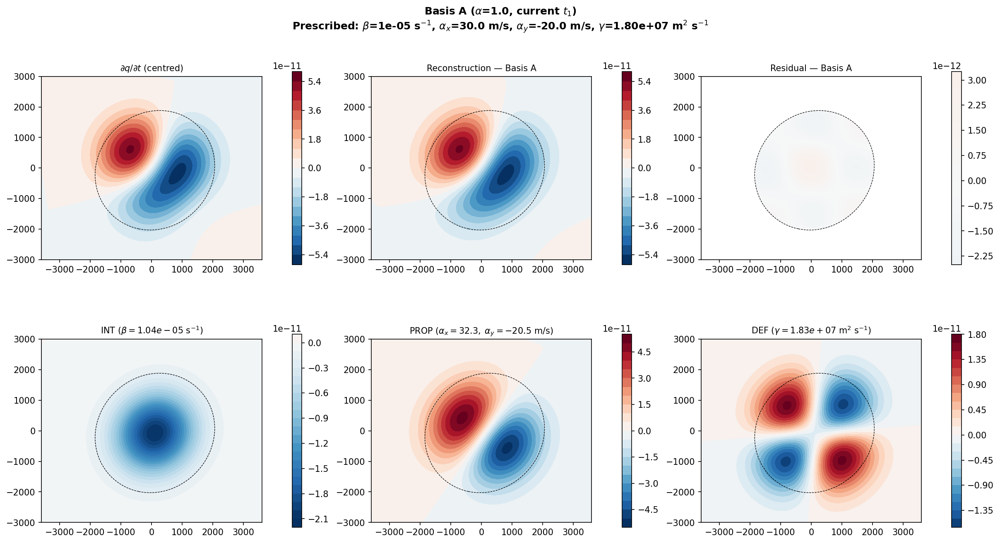
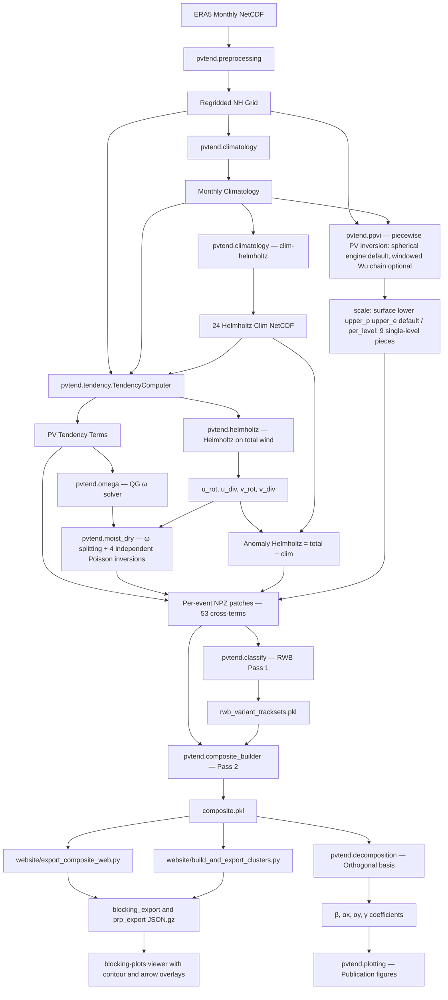
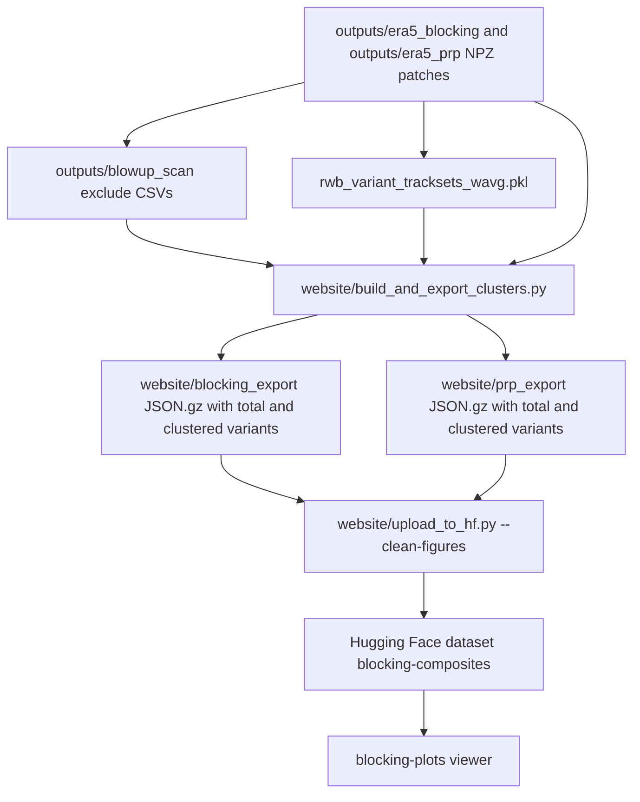
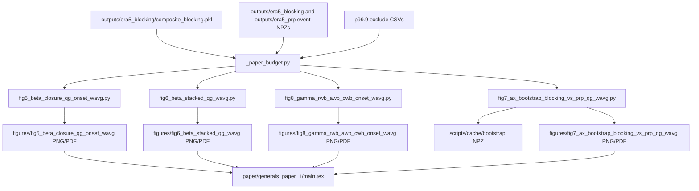

# pvtend

[](https://pypi.org/project/pvtend/)
[](https://github.com/yanxingjianken/pvtend/actions)
[](https://pvtend.readthedocs.io/en/latest/)
[](LICENSE)

**PV tendency decomposition for atmospheric blocking, propagating anticyclones, and all synoptic-scale cyclonic event lifecycle analysis.**

`pvtend` diagnoses the growth, propagation, and decay of mid-latitude weather events by decomposing potential vorticity (PV) tendencies from ERA5 pressure-level data onto physically meaningful components using an orthogonal basis framework. This is the Part I work of Yan et al. (in prep.) about blocking lifecycle analyses on onset, peak, decay stages.

## Gallery

<table>
<tr>
<td width="50%" align="center">
<br/>
<em>Idealized validation — a Gaussian PV anomaly with prescribed propagation,
intensification, and deformation is decomposed into six orthogonal bases
and reconstructed with near-zero residual.</em>
</td>
<td width="50%" align="center">
<br/>
<em>Real ERA5 blocking event (track 425) — animated lifecycle showing
total PV on a cartopy map (left) and the six projected basis components
(right) evolving from 13 h pre-onset to 12 h post-onset.
The analysis is done on a weighted average surface across 300, 250, 200 hPa levels.</em>
</td>
</tr>
<tr>
<td colspan="2" align="center">
<br/>
<em>Geopotential-height (Z500) variant of the six-basis decomposition
(track 425) — animated lifecycle showing Z anomaly from the 1990–2020
hourly climatology, with adaptive prenorm and blockid contour overlay.
See notebook <code>03z_six_basis_projection_geopotential</code>.</em>
</td>
</tr>
</table>

### Event catalogues

Blocking and PRP-high events are identified as persistent anticyclonic anomalies in 500 hPa geopotential height.
We are using [**TempestExtremes** v2.1](https://gmd.copernicus.org/articles/14/5023/2021/) to track contiguous Z500 anomaly features that exceed a fixed threshold for ≥5 days, producing CSV catalogues with columns for event ID, centre lat/lon, onset/peak/decay timestamps, and area. Following the threshold as in [Drouard et al. (2021)](https://agupubs.onlinelibrary.wiley.com/doi/abs/10.1029/2020JD034082), we separate the tracked features into blocking and propagating (prp) high pressure systems.

> **Sample catalogue (ERA5, 1990–2020 blocking):** [`ERA5_TempestExtremes_z500_anticyclone_blocking.csv`](https://github.com/yanxingjianken/pvtend/raw/main/docs/_static/ERA5_TempestExtremes_z500_anticyclone_blocking.csv)

The CSVs are the inputs for `pvtend-pipeline compute`, which extracts event-centred patches and runs the full PV-tendency decomposition for each event in the blocking/prp catalogue.

## Features

- **Helmholtz-first architecture** (v2.0): Helmholtz decomposition on the **total wind** field; climatological Helmholtz pre-computed as 24 monthly NetCDF files; anomaly Helmholtz = total − clim (no separate anomaly solve)
- **53 cross-term PV tendency budget**: 20 primary + 16 alt-vertical + 16 div dry/moist horizontal + Q_LHR, all written per-timestep to NPZ
- **PV tendency computation**: RHS has zonal advection, baroclinic counter propagation, vertical advection, and approximated diabatic heating terms.
- **QG omega solver**: Hoskins Q-vector formulation with **two methods**: LOG20/SIP (default, Numba-accelerated 3-D elliptic, Li & O'Gorman 2020) and SP19 (Steinfeld & Pfahl 2019 empirical 1/3 scaling). Optional `center_lat` for dynamic f₀. **Divergence guard (v2.23)**: a SIP solve whose final residual ratio is not finite or above one (the 0.93 relaxation runs away on the anisotropic 75–85 N rows of some events and returns 1e38 Pa/s with no error) is restarted from the same initial state at α = 0.5; converged solves are untouched (byte-identical output), and every NPZ records `omega_sip_final_residual/alpha/iters/retried/diverged_{adiabatic,qg_diabatic,lhr_moist}` for the blow-up scan (`--fields sip`).
- **Helmholtz decomposition**: Spherical vorticity/divergence (with tan φ/a metric), conservative spherical Poisson solver (FFT in lon + tridiagonal in lat), spectral gradient for wind recovery — all on the full NH grid. Since v2.10 a **spherical-harmonic backend** (`pvtend.sh_ops`, via `pyspharm`) is the default (`method="spectral"`); legacy FFT path remains as `method="fft"`. NH inputs are parity-mirrored to the global sphere, giving a near-zero harmonic residual.
- **Four-way omega decomposition**: ω_dry (QG A+B), ω_qg_moist (term C via ∂T/∂t), ω_emanuel_moist (Emanuel LHR), ω_moist (full residual), with corresponding divergent winds recovered by **independent** spherical Poisson inversion (verified linear to machine precision)
- **Orthogonal basis decomposition**: Projects PV tendency onto intensification (β), propagation (αx, αy), and deformation (γ) modes. Built-in **temporal down-scaling** (bi-linear interpolation, α = 0.75 by default) from hourly to 15-minute evaluation instants via `_next` keyword arguments. **Single-blob selection**: when the threshold mask produces multiple disconnected regions, only the connected component enclosing (or nearest to) the patch centre is retained
- **RWB detection**: Two classification methods — **bay** (path-order, recommended with circumpolar-cropped contours) and **tilt** (centerline slope ±0.15 dead zone). Circumpolar-first contour extraction for robust NH analysis. Each event-stage is labelled **AWB / CWB / Omega (both bays) / NEUTRAL**. The single-field public API `pvtend.classify.classify_z_field(z2d, x_rel, y_rel)` + `label_from_flags(...)` classifies one 2-D Z patch on any grid; `pvtend-pipeline classify --patches <.npz|.nc>` classifies a pre-extracted patch stack (e.g. CESM f09) to a label CSV (the NPZ tree → PKL stays the default).
- **Composite lifecycle**: Multi-stage ensemble averaging with onset/peak/decay staging
- **NaN-safe throughout**: All grid, derivative, solver, bootstrap, and plotting routines use `nanmean`/`nanpercentile` to handle partial-NaN edge events without corrupting composites or flipping projection signs
- **ω blowup detection** (v2.10.8): Per-event NPZ scan via `scripts/aggregate_qg_blowup.py`. Each event NPZ embeds `max_abs_w_{adiabatic,diabatic,qg_diabatic,lhr_moist}_300` scalars; tracks whose any-stage max exceeds **25 Pa/s** are flagged. Raw ERA5 ω is observationally bounded (1990-2020 hourly: max=22.4, 99.9th=19.9 Pa/s) so only the QG-solver output ever blows up. Replaces both the silent in-solver ±5 Pa/s clip used in pvtend ≤ 2.9 and the v2.10.1–7 raw-ERA5 glob scan.
- **Piecewise PV inversion (PPVI)**: attributes the balanced rotational-wind anomaly to its PV/θ sources across **9 levels 1000→100 hPa** (the 1000 hPa bottom-θ and 100 hPa top-θ pieces are Bretherton boundary sheets). Two engines, `--ppvi-engine`: **`spherical`** (default since v2.22) inverts on the closed sphere with the vendored spectral Newton–Krylov solver (`ppvi/spherical/`, a verbatim copy of `pv_inversion_spherical`; adapter `ppvi/spherical_engine.py`) — no lateral wall, no `ibc`, ordinary points at the pole, float64, every catalogue event converging in ~4 Newton steps; **`windowed`** is the Wu/Davis nonlinear-balance relaxation (f2py `_wuppvi` cores: pvpialln → qinvert21 → qinvertp21) on the fixed 10.5–85.5 N band with an event-centred ±90° window, which stores the lateral-boundary response as a `wall` piece. Two decompositions, `--ppvi-pieces`: **`scale`** (default) gives four pieces `surface`/`lower`/`upper_p`/`upper_e`, splitting the upper levels into a planetary (zonal k≤4, confined to the tracked object) and an eddy part; `per_level` gives the 9 single-level pieces `u/v_rot_anom_ppvi_{L}(_3d)`. Every mode writes `u/v_rot_anom_residual_ppvi(_3d)` (record's observed anomaly − Σ pieces) and `pv_anom_wu(_3d)`; the spherical engine adds `u/v_rot_anom_sph(_3d)` (its own observed anomaly, which the pieces close against exactly) and the `ppvi_*` convergence scalars. The pieces sum **exactly** to the all-sources solve (midpoint linearisation of a quadratic system). Enabled by default in `compute` (`--with-ppvi`); migrate existing NPZ with the `ppvi` subcommand. Different modes and engines write different key sets — do not mix them in one output directory. In `scale` mode the writer also persists the **archive-PV split itself**: `pv_anom_p(_3d)` / `pv_anom_e(_3d)` and `pv_split_mask_3d`, seeded on the archive anomaly (v2.17).
  **Grid-agnostic (v2.13/v2.14)**: `invert_piecewise` runs on any regular grid including **anisotropic** ones (Δlat≠Δlon, e.g. CESM f09 — the `zhdr` spacings are reordered internally to the Fortran's HDR(5)=Δlon/HDR(6)=Δlat convention) and hydrostatically gap-fills below-ground NaN (`fill_below_ground`); the ERA5 isotropic path stays byte-identical. The `GridProfile` config (`ERA5_1P5_NH` default, `CESM_F09`) carries the grid + inversion-band metadata. One thing is **not** negotiable: the Wu cores are never given latitudes, they rebuild each row's as `lat_n−(I−1)·Δlat` and key cos φ and the Coriolis *f* off that index, so the inversion band must run **north→south**. `_ppvi_geom` reverses south→north archives (CESM f09) to match; ERA5 already descends.
- **CLI pipeline**: End-to-end processing via `pvtend-pipeline` command (`compute`, `clim-helmholtz`, `classify`, `composite`, `decompose`, `blowup-scan`, `ppvi`)

## Installation

```bash
# From PyPI
pip install pvtend

# Or with uv (fast, Rust-based installer)
uv pip install pvtend

# From source (development)
git clone https://github.com/yanxingjianken/pvtend.git
cd pvtend
pip install -e ".[dev]"

# With micromamba
micromamba create -f environment.yml
micromamba activate pvtend_env
pip install -e ".[dev]"
```

### Spherical-harmonic backend (recommended)

The Helmholtz / QG-ω velocity-potential / mixed-second-derivative
operators default to a spherical-harmonic backend
(`pvtend.sh_ops`, built on `pyspharm` / `windspharm`).  These two
packages compile Fortran code at install time, so they are kept as an
**optional extra**:

```bash
# conda-forge ships pre-built wheels (recommended)
micromamba install -c conda-forge windspharm pyspharm

# Or via pip with numpy already installed and a Fortran compiler:
pip install --no-build-isolation pyspharm windspharm
```

With these installed, ``method="spectral"`` (the default) is used.
Without them, callers fall back to the legacy FFT path or raise a clear
error directing the user to install the SH extras.

## Quick Start

```python
import numpy as np
from pvtend import NHGrid, ddx, ddy, compute_orthogonal_basis, project_field

# Grid setup
grid = NHGrid(lat=np.linspace(90, 0, 61), lon=np.linspace(-180, 178.5, 240))
dx_arr = grid.dx_arr  # zonal spacing per latitude [m]
dy = grid.dy           # meridional spacing [m]

# Compute zonal derivative
dfdx = ddx(field, dx_arr, periodic=False)

# Orthogonal basis decomposition
basis = compute_orthogonal_basis(pv_anom, pv_dx, pv_dy, x_rel, y_rel)
result = project_field(tendency, basis)
print(f"β = {result['beta']:.3e}")  # intensification rate
```

### CLI Pipeline

```bash
# Step 0a: Pre-compute Helmholtz climatology (once, ~5 min)
pvtend-pipeline clim-helmholtz \
    --clim-dir /data/climatology/ \
    --out-dir /data/climatology/

# Step 1: Compute PV tendencies → per-event NPZ files
pvtend-pipeline compute \
    --event-type blocking \
    --events-csv events.csv \
    --era5-dir /data/era5/ \
    --clim-path /data/climatology/era5_hourly_clim.nc \
    --clim-helmholtz-dir /data/climatology/ \
    --out-dir /data/composite_blocking_tempest/ \
    --dh-range=-49:25 --skip-existing

# Step 2: RWB classification → variant tracksets PKL
#   --levels accepts integer hPa values or 'wavg' (weighted-average Z)
pvtend-pipeline classify \
    --npz-dir /data/composite_blocking_tempest/ \
    --output /data/outputs/rwb_variant_tracksets.pkl \
    --stages onset peak decay \
    --levels 500 400 300 200 --threshold 3

# Step 3: Variant-aware composite accumulation → composite PKL
pvtend-pipeline composite \
    --npz-dir /data/composite_blocking_tempest/ \
    --rwb-pkl /data/outputs/rwb_variant_tracksets.pkl \
    --pkl-out /data/outputs/composite.pkl

# Step 4 (optional): Orthogonal-basis decomposition
pvtend-pipeline decompose \
    --pkl-in /data/outputs/composite.pkl \
    --out-dir /data/outputs/decomp/
```

## Workflow


```mermaid
graph TD
    A[ERA5 Monthly NetCDF] --> B[pvtend.preprocessing]
    B --> C[Regridded NH Grid]
    C --> D[pvtend.climatology]
    D --> E[Monthly Climatology]
    E --> E2[pvtend.climatology — clim-helmholtz]
    E2 --> E3[24 Helmholtz Clim NetCDF]
    C & E & E3 --> F[pvtend.tendency.TendencyComputer]
    F --> G[PV Tendency Terms]
    F --> I[pvtend.helmholtz — Helmholtz on total wind]
    I --> I2[u_rot, u_div, v_rot, v_div]
    I2 & E3 --> I3[Anomaly Helmholtz = total − clim]
    G --> H[pvtend.omega — QG ω solver]
    H & I2 --> J[pvtend.moist_dry — ω splitting + 4 independent Poisson inversions]
    G & J & I3 --> K[Per-event NPZ patches — 53 cross-terms]
    C & E --> P1[pvtend.ppvi — piecewise PV inversion: spherical engine default, windowed Wu chain optional]
    P1 --> P2[scale: surface lower upper_p upper_e default / per_level: 9 single-level pieces]
    P2 --> K
    K --> L1[pvtend.classify — RWB Pass 1]
    L1 --> L1a[rwb_variant_tracksets.pkl]
    K & L1a --> L2[pvtend.composite_builder — Pass 2]
    L2 --> L2a[composite.pkl]
    L2a --> W1[website/export_composite_web.py]
    L2a --> W2[website/build_and_export_clusters.py]
    W1 --> W3[blocking_export and prp_export JSON.gz]
    W2 --> W3
    W3 --> W4[blocking-plots viewer with contour and arrow overlays]
    L2a --> M[pvtend.decomposition — Orthogonal basis]
    M --> N[β, αx, αy, γ coefficients]
    N --> O[pvtend.plotting — Publication figures]
```

## Website Export

The repository also contains a lightweight website export pipeline for the blocking/PRP composite viewer. The JSON exports under `website/blocking_export/` and `website/prp_export/` are built from the latest per-event NPZ patches, RWB trackset pickles, and blowup-exclusion CSVs. The exports include grouped field metadata, basis payloads, and vector-overlay definitions so the viewer can switch between scalar contours and wind-arrow overlays.

`website/build_and_export_clusters.py` prefers `rwb_variant_tracksets_wavg.pkl` and applies `outputs/blowup_scan/exclude_tracks_{event_type}.csv` by default when the file exists. This keeps the web viewer's `All Events` count and fields consistent with the screened production composites and avoids uploading composites contaminated by QG-omega blowup tracks. The clustered export also writes parent total variants (`awb`, `cwb`, and `rwb`) for all events with anticyclonic, cyclonic, or either type of wave breaking, alongside the regional sub-clusters. `website/upload_to_hf.py --clean-figures` uploads the refreshed `blocking/` and `prp/` JSON trees, removes stale remote JSONs, deletes the old Hugging Face `figures/` folder, and uploads `website/README.md` as the dataset card.

```bash
cd /net/flood/data2/users/x_yan/pvtend
micromamba run -n blocking python website/build_and_export_clusters.py --event-type blocking
micromamba run -n blocking python website/build_and_export_clusters.py --event-type prp
micromamba run -n blocking python website/upload_to_hf.py --clean-figures
```


```mermaid
graph TD
    A[outputs/era5_blocking and outputs/era5_prp NPZ patches] --> B[outputs/blowup_scan exclude CSVs]
    A --> C[rwb_variant_tracksets_wavg.pkl]
    B --> D[website/build_and_export_clusters.py]
    C --> D
    A --> D
    D --> E[website/blocking_export JSON.gz with total and clustered variants]
    D --> F[website/prp_export JSON.gz with total and clustered variants]
    E --> G[website/upload_to_hf.py --clean-figures]
    F --> G
    G --> H[Hugging Face dataset blocking-composites]
    H --> I[blocking-plots viewer]
```

## Publication Figures

The `paper/generals_paper_1/scripts/` directory contains the current paper Figure 5-8 generation workflow. Shared budget definitions live in `_paper_budget.py`, which centralizes the Eq. 11 term mapping, the pressure-weighted `wavg` level, the `q'<0` projection basis, p99.9 track-exclusion lists, and the Figure 7 bootstrap cache location.

- `fig5_beta_closure_qg_onset_wavg.py` renders the blocking-onset raw PV-tendency closure and corresponding `beta*Phi_1` projections in two four-column blocks. The stationary-flow and baroclinic advection terms are split into separate columns, with term subtitles, panel-specific colorbars, a shared range for the six process-projection colorbars, total-PV contours on the LHS panel, and wind arrows on the other raw-term panels.
- `fig6_beta_stacked_qg_wavg.py` renders the wavg-only onset lifecycle stacked-bar budget for `beta`, with the direct `partial q / partial t` projection overlaid as a black step curve and colors matched to `examples/05_stacked_bar_beta.ipynb` cell 14.
- `fig7_ax_bootstrap_blocking_vs_prp_qg_wavg.py` renders peak-stage blocking versus propagating-anticyclone `alpha_x` bootstrap bars from event NPZs after excluding p99.9 blowup tracks. Projections use the full event fields without a pre-projection significance mask, the `pv_dt` bars include simple mean-value labels, and repeated runs reuse `paper/generals_paper_1/scripts/cache/` when the inventory and settings match.
- `fig8_gamma_rwb_awb_cwb_onset_wavg.py` renders AWB/CWB onset raw maps and `-gamma_1*Phi_4 - gamma_2*Phi_5` deformation projections for four selected Eq. 11 terms. It uses QG-diabatic paper definitions, one colorbar per panel, and Figure-2-style arrows oriented along the negative PV-tendency dipoles of the blocking anomaly.

All four scripts write PNG and PDF files into `paper/generals_paper_1/figures/`, and `paper/generals_paper_1/main.tex` includes the generated PNGs.


```mermaid
graph TD
    A[outputs/era5_blocking/composite_blocking.pkl] --> B[_paper_budget.py]
    B --> C[fig5_beta_closure_qg_onset_wavg.py]
    B --> D[fig6_beta_stacked_qg_wavg.py]
    B --> M[fig8_gamma_rwb_awb_cwb_onset_wavg.py]
    E[outputs/era5_blocking and outputs/era5_prp event NPZs] --> B
    F[p99.9 exclude CSVs] --> B
    B --> G[fig7_ax_bootstrap_blocking_vs_prp_qg_wavg.py]
    G --> H[scripts/cache/bootstrap NPZ]
    C --> I[figures/fig5_beta_closure_qg_onset_wavg PNG/PDF]
    D --> J[figures/fig6_beta_stacked_qg_wavg PNG/PDF]
    G --> K[figures/fig7_ax_bootstrap_blocking_vs_prp_qg_wavg PNG/PDF]
    M --> N[figures/fig8_gamma_rwb_awb_cwb_onset_wavg PNG/PDF]
    I & J & K & N --> L[paper/generals_paper_1/main.tex]
```

## Package Structure

```
src/pvtend/
├── __init__.py          # Public API
├── _version.py          # Version
├── cli.py               # CLI entry point (clim-helmholtz, compute, classify, composite, decompose)
├── constants.py         # Physical constants
├── grid.py              # NH grid & event patches
├── preprocessing.py     # ERA5 loading & regridding
├── derivatives.py       # Finite difference operators
├── climatology.py       # Fourier-filtered climatology + Helmholtz climatology (compute/load)
├── omega.py             # QG omega solver (LOG20/SIP or SP19)
├── helmholtz.py         # Helmholtz decomposition (spherical Poisson + spectral gradient + laplacian_spherical_fft)
├── moist_dry.py         # Moist/dry omega split & independent Poisson wind recovery (solve_chi_from_omega, verify_div_additivity)
├── isentropic.py        # Isentropic PV-tendency diagnostics
├── tendency.py          # Main pipeline: Helmholtz-first, 53 cross-terms, data loading, derivatives, NPZ output
├── classify.py          # RWB classification Pass 1 (AWB/CWB/Omega/NEUTRAL → variant PKL; classify_z_field single-field API)
├── composite_builder.py # Variant-aware composite accumulation Pass 2
├── rwb.py               # RWB detection (bay & tilt methods, circumpolar-first)
├── composites.py        # Legacy composite lifecycle
├── data/                # Bundled sample data
│   ├── __init__.py      # load_idealized_pv() loader
│   └── idealized_pv.npz # Synthetic Gaussian PV evolution
├── decomposition/       # Orthogonal six-basis framework
│   ├── __init__.py
│   ├── smoothing.py
│   ├── basis.py
│   ├── interpolation.py # Temporal bi-linear interpolation (lerp_fields)
│   └── projection.py
├── plotting/            # Visualization
│   ├── __init__.py
│   ├── basis_plots.py
│   ├── coefficient_plots.py
│   ├── field_plots.py
│   ├── composite_explorer.py  # plot_var: single-variable composite explorer with bootstrap
│   └── baroclinic.py          # plot_baroclinic_tilt: two-level v′ overlay
└── io/                  # File I/O
    ├── __init__.py
    ├── era5.py
    ├── npz.py
    └── pkl.py

website/
├── export_composite_web.py   # JSON.gz export for the blocking/PRP web viewer
├── build_and_export_clusters.py # Cluster-aware export and diagnostics generation
├── upload_to_hf.py           # Sync local website exports to Hugging Face
├── blocking_export/          # Exported blocking viewer payloads
├── prp_export/               # Exported PRP viewer payloads
└── cluster_diagnostics/      # Cluster composite diagnostics used for QA
```

## Example Notebooks

Notebooks using **real ERA5 blocking event data** from the `composite_blocking_tempest`, `composite_prp_tempest` (single event npz), `tempest_extreme_4_basis/outputs`, and `tempest_extreme_4_basis/outputs_prp` (composite pkl) pipeline:

| Notebook | Description |
|----------|-------------|
| [`00_idealized_6basis`](examples/00_idealized_6basis.ipynb) | Idealized Gaussian PV anomaly: prescribed β/αx/αy/γ₁/γ₂/σ at two timesteps, 6-basis visualisation, Gram-Schmidt, projection & reconstruction |
| [`00_idealized_5basis`](examples/00_idealized_5basis.ipynb) | Idealized single negative Gaussian PV anomaly matching paper Figure 3: prescribed β/αx/αy/γ₁/γ₂, 5-basis visualisation, projection & reconstruction |
| [`01_rwb_and_derivatives`](examples/01_rwb_and_derivatives.ipynb) | Grid setup, `ddx`/`ddy`/`ddp` derivatives, RWB detection on a real event |
| [`02_helmholtz_and_qg_omega`](examples/02_helmholtz_and_qg_omega.ipynb) | 3-D Helmholtz decomposition, QG omega (LOG20 vs SP19), moist/dry ω split |
| [`03_six_basis_projection`](examples/03_six_basis_projection.ipynb) | Orthogonal 6-basis (Φ₁–Φ₆), project dq'/dt → β/αx/αy/γ₁/γ₂/σ, lifecycle curves |
| [`03_six_basis_projection_composite`](examples/03_six_basis_projection_composite.ipynb) | ↳ *Composite variant*: 6-basis projection averaged across multiple events |
| [`03c_six_basis_cyclone`](examples/03c_six_basis_cyclone.ipynb) | ↳ *Cyclone variant*: 6-basis projection for a 300 hPa cyclone (PV > 0), lifecycle + budget closure |
| [`03prp_six_basis_anticyclone_timed_bases`](examples/03prp_six_basis_anticyclone_timed_bases.ipynb) | ↳ *Anticyclone variant*: 6-basis projection for a 300 hPa anticyclone (PV < 0, `mask="< -2e-7"`), current-time basis |
| [`03z_six_basis_projection_geopotential`](examples/03z_six_basis_projection_geopotential.ipynb) | ↳ *Supplement*: same 6-basis projection using **geopotential height Z** instead of PV |
| [`04_single_var_composite`](examples/04_single_var_composite.ipynb) | Single-variable composite explorer on pressure levels using `pvtend.plotting.plot_var` |
| [`04i_single_var_isentropic_composite`](examples/04i_single_var_isentropic_composite.ipynb) | ↳ *Supplement*: same as 04 but on **isentropic (θ) surfaces** |
| [`05_stacked_bar_beta`](examples/05_stacked_bar_beta.ipynb) | Stacked-bar β decomposition by PV-tendency term across lifecycle hours |
| [`05b_grouped_terms_bootstrap`](examples/05b_grouped_terms_bootstrap.ipynb) | ↳ *Supplement*: grouped PV-tendency terms with **bootstrap resampling & significance** |
| [`06_baroclinic_structure`](examples/06_baroclinic_structure.ipynb) | 3-D composite PV anomaly, lon–p cross-sections, 2-PVU tropopause, v′ tilt via `plot_baroclinic_tilt` |
| [`07_facet_blocking_vs_prp`](examples/07_facet_blocking_vs_prp.ipynb) | Facet comparison of blocking vs PRP: bar charts with bootstrap significance, shared-cbar spatial maps, baroclinic tilt |

## Testing

```bash
pytest tests/ -v
```

## Documentation

Full documentation at [pvtend.readthedocs.io](https://pvtend.readthedocs.io).

Build locally:

```bash
cd docs && make html
```

## Citation

If you use this package in your research, please cite:

```bibtex
@software{yan2025pvtend,
  author = {Yan, Xingjian and Tamarin-Brodsky, Talia},
  title = {pvtend: PV tendency decomposition for atmospheric blocking},
  year = {2025},
  url = {https://github.com/yanxingjianken/pvtend}
}
```

## License

MIT — see [LICENSE](LICENSE).
