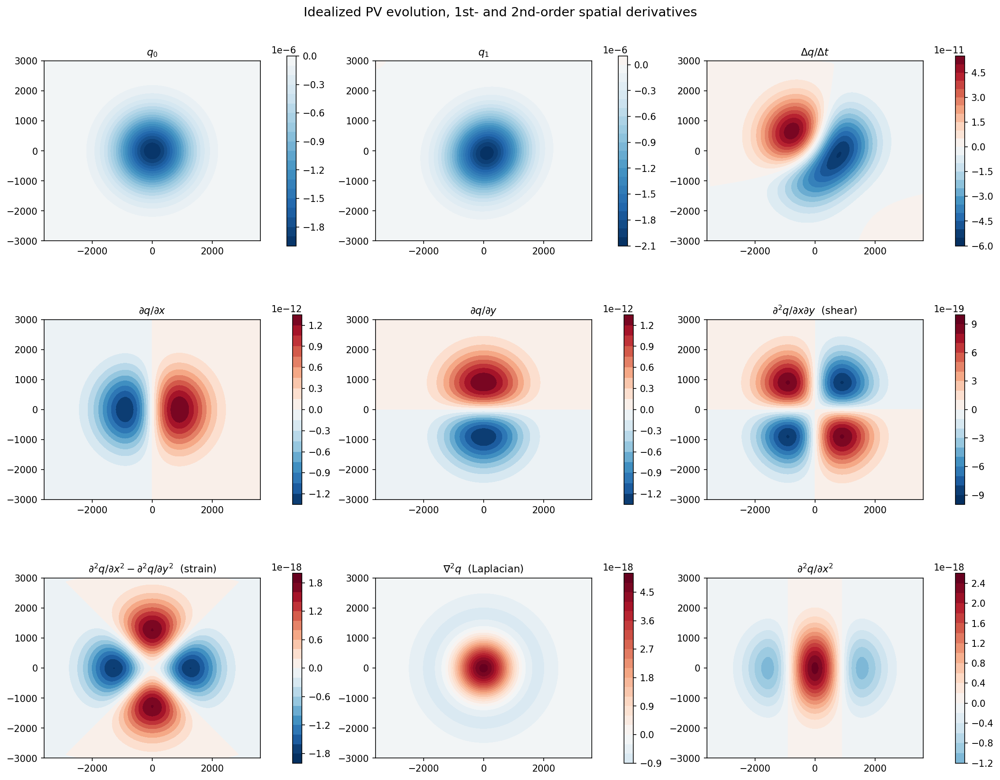
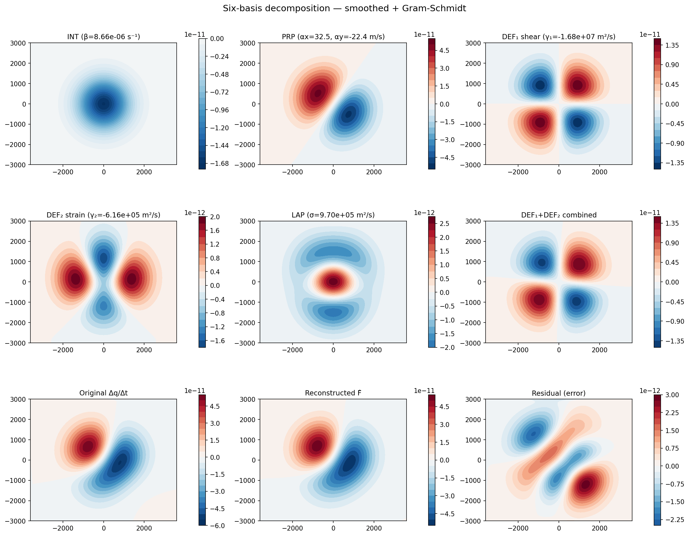

Quickstart
==========

Basic usage — load data & compute derivatives
----------------------------------------------

``pvtend`` ships with an idealized Gaussian PV anomaly that undergoes
simultaneous propagation, intensification, and deformation over one
hour.  Let's load it, compute all the spatial/temporal derivatives
(including the second-order terms needed for the six-basis
decomposition), and visualise them.

.. code-block:: python

   import numpy as np
   import matplotlib.pyplot as plt
   import pvtend

   # ── 1. Load bundled sample data ──────────────────────────────────
   d = pvtend.load_idealized_pv()
   q0, q1 = d["q0"], d["q1"]          # PV at t=0 and t=1   [PVU]
   x_km, y_km = d["x_km"], d["y_km"]  # coordinate vectors   [km]
   x_deg, y_deg = d["x_deg"], d["y_deg"]
   dx_arr, dy_m, dt = d["dx_arr"], float(d["dy_m"]), float(d["dt"])

   print(f"Grid shape: {q0.shape},  Δx = {float(d['dx_m'])/1e3:.0f} km,  Δt = {dt:.0f} s")

   # ── 2. First-order derivatives ───────────────────────────────────
   dq_dx = pvtend.ddx(q0, dx_arr, periodic=False)  # ∂q/∂x  [PVU/m]
   dq_dy = pvtend.ddy(q0, dy_m)                     # ∂q/∂y  [PVU/m]
   dq_dt = (q1 - q0) / dt                           # Δq/Δt  [PVU/s]

   # ── 3. Second-order derivatives (for the six-basis fields) ───────
   dq_dxdy = pvtend.ddy(dq_dx, dy_m)                              # ∂²q/∂x∂y  (Φ₄ shear)
   dq_dx2  = pvtend.ddx(dq_dx, dx_arr, periodic=False)            # ∂²q/∂x²
   dq_dy2  = pvtend.ddy(dq_dy, dy_m)                              # ∂²q/∂y²
   strain  = dq_dx2 - dq_dy2                                      # ∂²q/∂x²−∂²q/∂y² (Φ₅ normal strain)
   laplacian = dq_dx2 + dq_dy2                                    # ∂²q/∂x²+∂²q/∂y² (Φ₆ Laplacian)

   # ── 4. Visualise (3 rows × 3 columns) ────────────────────────────
   panels = [
       (q0,        r"$q_0$"),
       (q1,        r"$q_1$"),
       (dq_dt,     r"$\Delta q / \Delta t$"),
       (dq_dx,     r"$\partial q / \partial x$"),
       (dq_dy,     r"$\partial q / \partial y$"),
       (dq_dxdy,   r"$\partial^2 q / \partial x \partial y$  (shear)"),
       (strain,    r"$\partial^2 q/\partial x^2 - \partial^2 q/\partial y^2$  (strain)"),
       (laplacian, r"$\nabla^2 q$  (Laplacian)"),
       (dq_dx2,    r"$\partial^2 q / \partial x^2$"),
   ]

   fig, axes = plt.subplots(3, 3, figsize=(15, 12), constrained_layout=True)
   for ax, (fld, title) in zip(axes.ravel(), panels):
       vm = np.nanmax(np.abs(fld)) or 1.0
       im = ax.contourf(x_km, y_km, fld, 21, vmin=-vm, vmax=vm, cmap="RdBu_r")
       ax.set_title(title, fontsize=11)
       ax.set_aspect("equal")
       plt.colorbar(im, ax=ax, shrink=0.75)
   fig.suptitle("Idealized PV evolution, 1st- and 2nd-order spatial derivatives", fontsize=14)
   plt.show()

Orthogonal basis decomposition
------------------------------

Using the derivatives from above, build the **six** orthogonal bases
(Φ₁ intensification / Φ₂–Φ₃ propagation / Φ₄–Φ₅ deformation /
Φ₆ Laplacian) via Gram-Schmidt, project the PV tendency, and compare
the reconstruction with the original.

.. code-block:: python

   from pvtend import compute_orthogonal_basis, project_field

   # ── 1. Build orthogonal basis ────────────────────────────────────
   #   pv_anom = q0  (the anomaly at t=0)
   #   smoothing_deg and grid_spacing are in degrees
   grid_sp = float(d["grid_spacing_deg"])

   basis = compute_orthogonal_basis(
       pv_anom=q0,
       pv_dx=dq_dx,
       pv_dy=dq_dy,
       x_rel=x_deg,
       y_rel=y_deg,
       mask="< 0",
       apply_smoothing=True,
       smoothing_deg=3.0,
       grid_spacing=grid_sp,
   )

   # ── 2. Project tendency onto basis ───────────────────────────────
   result = project_field(dq_dt, basis)

   print(f"β  (intensification)     = {result['beta']:.3e} s⁻¹")
   print(f"αx (zonal propagation)   = {result['ax']:.1f} m/s")
   print(f"αy (merid. propagation)  = {result['ay']:.1f} m/s")
   print(f"γ₁ (shear deformation)   = {result['gamma1']:.3e} m² s⁻¹")
   print(f"γ₂ (normal strain)       = {result['gamma2']:.3e} m² s⁻¹")
   print(f"σ  (Laplacian/diffusion) = {result['sigma']:.3e} m² s⁻¹")
   print(f"RMSE                     = {result['rmse']:.3e}")

   # ── 3. Visualise (3 rows × 3 columns) ────────────────────────────
   panels2 = [
       (result["int"],   rf"INT ($\beta$={result['beta']:.2e} s$^{{-1}}$)"),
       (result["prop"],  rf"PRP ($\alpha_x$={result['ax']:.1f}, $\alpha_y$={result['ay']:.1f} m/s)"),
       (result["def1"],  rf"DEF$_1$ shear ($\gamma_1$={result['gamma1']:.2e} m$^2$/s)"),
       (result["def2"],  rf"DEF$_2$ strain ($\gamma_2$={result['gamma2']:.2e} m$^2$/s)"),
       (result["lap"],   rf"LAP ($\sigma$={result['sigma']:.2e} m$^2$/s)"),
       (result["def"],   r"DEF$_1$+DEF$_2$ combined"),
       (dq_dt,           r"Original $\Delta q / \Delta t$"),
       (result["recon"], r"Reconstructed $\hat{F}$"),
       (result["resid"], "Residual (error)"),
   ]

   fig, axes = plt.subplots(3, 3, figsize=(15, 12), constrained_layout=True)
   for ax, (fld, title) in zip(axes.ravel(), panels2):
       vm = np.nanmax(np.abs(fld)) or 1.0
       im = ax.contourf(x_km, y_km, fld, 21, vmin=-vm, vmax=vm, cmap="RdBu_r")
       ax.set_title(title, fontsize=11)
       ax.set_aspect("equal")
       plt.colorbar(im, ax=ax, shrink=0.75)
   fig.suptitle("Six-basis decomposition — smoothed + Gram-Schmidt", fontsize=14)
   plt.show()

Command-line pipeline
---------------------

The full production pipeline is a **three-pass** workflow:

0. **Pre-compute Helmholtz climatology** (one-time) — decompose the
   climatological (ū, v̄) into rotational / divergent parts for each month.
   Results are cached as 24 NetCDF files (~seconds).
1. **Compute** (Pass 0) — extract PV tendency terms for each tracked event into
   per-timestep NPZ files.  This is the most expensive step; with
   ``--n-workers 48`` it takes **~12 hours** for ~500 events.
2. **Classify** (Pass 1) — detect Rossby Wave Breaking on the NPZ
   patches and label each event as AWB, CWB, or neutral (~minutes).
3. **Composite** (Pass 2) — accumulate NPZ fields into variant-aware
   composites, stratified by RWB type (~seconds).

.. code-block:: bash

   # ── Pass 0a: Pre-compute Helmholtz climatology (one-time) ────────
   pvtend-pipeline clim-helmholtz \
       --clim-dir /path/to/climatology/ \
       --output-dir /path/to/climatology/ \
       --clim-stem era5_hourly_clim_1990-2020

   # ── Pass 0: Compute PV tendencies ────────────────────────────────
   # Recommended: 48 parallel workers → ~12 h for ~500 blocking events
   pvtend-pipeline compute \
       --event-type blocking \
       --events-csv tracked_events.csv \
       --era5-dir /path/to/era5/ \
       --clim-path /path/to/climatology/era5_hourly_clim.nc \
       --clim-helmholtz-dir /path/to/climatology/ \
       --out-dir /path/to/output/ \
       --dh-range='-49:25:1' \
       --center-mode eulerian \
       --year-range '1990:2011' \
       --stages onset peak decay \
       --n-workers 48 \
       --skip-existing

   # ── Pass 1: RWB classification ───────────────────────────────────
   #   Detects overturning PV contours on multiple pressure levels and
   #   classifies each event-stage as AWB / CWB / neutral.
   #   --levels accepts integer hPa values or 'wavg' (weighted-average Z).
   pvtend-pipeline classify \
       --npz-dir /path/to/output/ \
       --output /path/to/outputs/rwb_variant_tracksets.pkl \
       --levels 500 400 300 200 \
       --threshold 3

   # ── Pass 2: Variant-aware composite ──────────────────────────────
   #   Accumulates NPZ fields, separately for "original", "AWB_onset",
   #   "CWB_peak", etc.  Produces a single composite.pkl.
   pvtend-pipeline composite \
       --npz-dir /path/to/output/ \
       --rwb-pkl /path/to/outputs/rwb_variant_tracksets.pkl \
       --pkl-out /path/to/outputs/composite_blocking.pkl

   # ── (Optional) Pass 3: Orthogonal basis decomposition ────────────
   pvtend-pipeline decompose \
       --pkl-in /path/to/outputs/composite_blocking.pkl \
       --out-dir /path/to/outputs/decomposition/

The resulting ``composite_blocking.pkl`` can be loaded and inspected in
Python:

.. code-block:: python

   from pvtend import load_composite_state

   comp = load_composite_state("composite_blocking.pkl")

   # Get composite-mean PV at peak + 0 h for AWB events
   pv_awb = comp.composite_mean_3d("pv_3d", stage="peak", dh=0, variant="AWB_peak")
